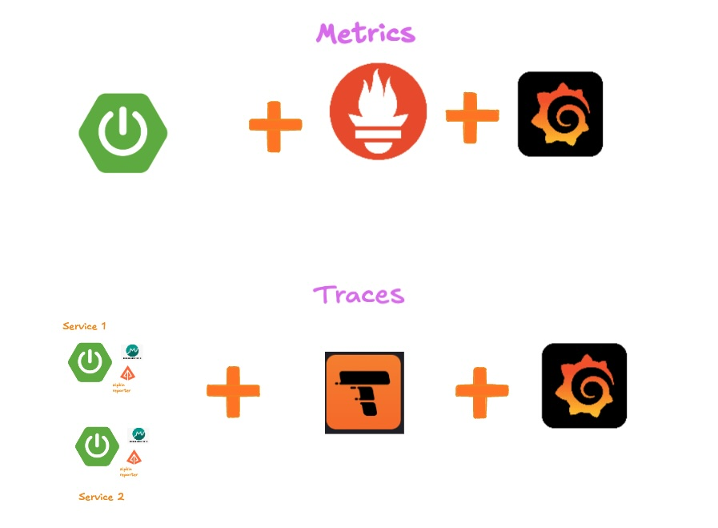

# metrics-traces-example

## To start the application and other services 
`./start-applications.sh`

## To stop all services and application
`./stop-application.sh `

## To generate some data for metrics
`./api-calls.sh`

## To trace API 
`curl http://localhost:8080/hello-traces`

Alternately you can use postman or any other app to make a rest API call

